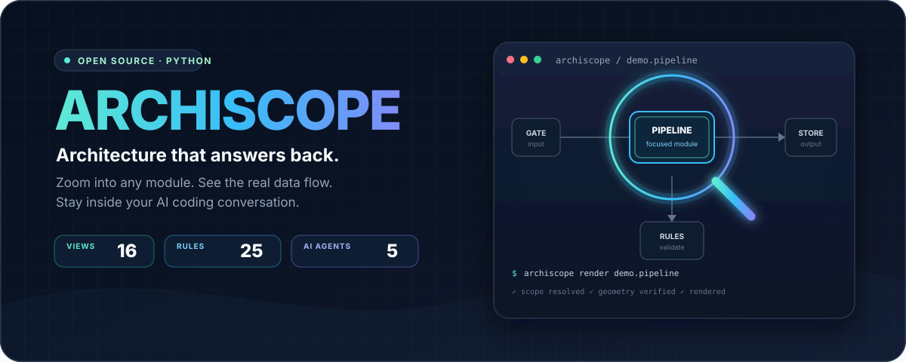
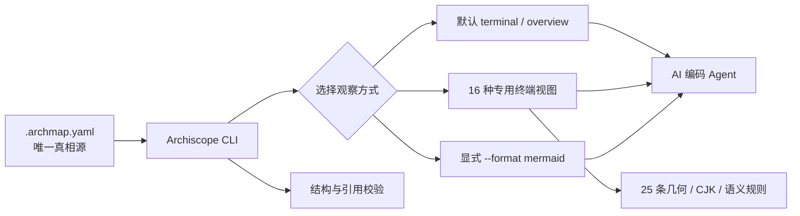

<p align="center">
  
</p>

<p align="center">
  <a href="https://github.com/BladeDancer743/archiscope/actions/workflows/ci.yml"></a>
  
  <a href="LICENSE"></a>
  
  
</p>

<p align="center">
  <strong>给 AI 编码 Agent 用的架构放大镜。</strong><br>
  在对话中展开任意模块，看清真实上下游、数据流和耦合关系。
</p>

<p align="center">
  <a href="#30-秒看懂">30 秒演示</a> ·
  <a href="#快速开始">快速开始</a> ·
  <a href="#默认-overview">默认总览</a> ·
  <a href="#可用视图16-种专用策略">16 种专用视图</a> ·
  <a href="docs/archmap-reference.md">Schema</a> ·
  <a href="docs/strategy-gallery.md">效果画廊</a> ·
  <a href="CONTRIBUTING.md">参与贡献</a>
</p>

---

架构不该只是画出来，它应该能在开发对话里被**放大、质询和验证**。

Archiscope 用一个 `.archmap.yaml` 保存项目架构，让 Claude Code、OpenCode、Codex、Cursor 和 GitHub Copilot 可以直接回答：

> “展开处理流水线。”<br>
> “谁依赖这个模块？”<br>
> “把数据流和耦合热点给我看。”

不切出终端，不翻 Wiki，不靠 Agent 猜目录结构。

## 30 秒看懂

```console
$ archiscope render all --charset ascii --color never
```

默认 `overview` 使用纵向分层总线拓扑。下面是布局合同示意，不对应 GEO 或任何项目统计：

```text
 VERTICAL LAYERED BUS TOPOLOGY - SCHEMATIC
             +..[EVT] projected feedback bus..........+
             v                                        .
L0                 +--------------------+              .
                   | [AUTH] 控制中心    |              .
                   +---------+----------+              .
              control fan-out bus                      .
             +---------------+---------------+         .
L1           v                               v         .
    +------------------+ [DAT] ----> +------------------+
    | [COMPUTE] 引擎甲 | [CMD] <---- | [COMPUTE] 引擎乙 |
    +---------+--------+              +--------+---------+
              |                               |         .
L2            v                               v         .
    +------------------+              +------------------+
    | [DATA] 存储      |              | [DELIVERY] 投递  |.
    +------------------+              +------------------+
 ISOLATED ------------------------------------------------
                   +----------------------+
                   | [ASSURANCE] 治理审计 |
                   +----------------------+
```

默认 `overview` 是可展开的终端字符拓扑；同一份架构数据还可切换为蓝图、热力矩阵、树、状态机、瀑布图等 16 种专用终端视图。旧 Mermaid 输出仍保留，但必须显式使用 `--format mermaid`。更多真实输出见[策略画廊](docs/strategy-gallery.md)。

## 为什么是 Archiscope

| | 普通架构文档 | Archiscope |
|---|---|---|
| 真相源 | 图、代码、Wiki 容易漂移 | 一个可校验的 `.archmap.yaml` |
| 使用位置 | 离开开发对话去找文档 | Agent 对话中直接“展开” |
| 观察尺度 | 一张大图塞下所有内容 | 按模块路径逐级聚焦 |
| 输出形态 | 固定画布 | 默认语义终端总览 + 16 种专用视图 + 显式 Mermaid |
| 可靠性 | 看维护者是否记得更新 | 引用校验 + 25 条几何/CJK/语义规则 |
| Agent 适配 | 各写一套提示词 | 5 个 Agent 一条命令安装 |

## 它如何工作



Archiscope 不分析或上传你的源码。它只读取项目根目录中的架构描述文件，在本地完成解析与渲染。

## 快速开始

### 1. 安装

```bash
pip install git+https://github.com/BladeDancer743/archiscope.git
```

> PyPI 发布尚未开放；当前安装源是本仓库。发布状态见 [CHANGELOG](CHANGELOG.md)。

### 2. 创建最小架构描述

在项目根目录新建 `.archmap.yaml`：

```yaml
schema: "archiscope/1.0"

aliases:
  处理流水线: demo.pipeline

semantics:
  features:
    ingestion: boundary
  relation_kinds:
    x-normalized-command: command

modules:
  root:
    label: Demo Platform
    type: root
    children: [demo.gateway, demo.pipeline]
    edges:
      - from: demo.gateway
        to: demo.pipeline
        kind: x-normalized-command
        payload_type: NormalizedEvent

  demo.gateway:
    label: Gateway
    type: engine
    parent: root
    feature: ingestion
    downstream: [demo.pipeline]

  demo.pipeline:
    label: Pipeline
    type: layer
    parent: root
    feature: compute
    upstream: [demo.gateway]
```

完整字段说明见 [`.archmap.yaml` 参考](docs/archmap-reference.md)，可运行示例见 [`examples/`](examples/)。

### 3. 验证并渲染

```bash
archiscope validate
archiscope render all
archiscope render all --depth 0
archiscope render all --depth 2
archiscope render "处理流水线"
archiscope render "处理流水线" --format mermaid
archiscope render all --color never --charset ascii --width 80
archiscope semantics audit
archiscope semantics audit . --json
archiscope render all --strategy blueprint
archiscope list-strategies
```

也可以使用模块入口：

```bash
python -m archiscope --version
```

### 4. 接入你的 Agent

```bash
# 自动检测并安装项目中的 Agent 适配文件
archiscope install --detect

# 或手动指定
archiscope install --agents claude-code opencode codex cursor copilot
```

安装后直接在对话中说“展开处理流水线”或“给我看全景数据流”。

## 默认 overview

`archiscope render PATH` 默认等价于 `--format terminal --strategy overview --depth 1`。全景会展开一级所有权；聚焦容器显示 ownership 框和域内关系；叶模块显示 upstream → focus → downstream。

`overview` 在同一画布内按逻辑层自上而下布局；每层可包含 `1..N` 个并排模块，物理行不足时稳定折行，未满行整体居中。控制关系使用扇出总线，引擎间 direct 关系使用独立 mesh lane，反馈关系走外侧总线，孤立模块进入显式 `ISOLATED` 区。渲染器不得选择“最长路径主链”、不得用关系账本替代主图，也不得因为框在物理上相邻就虚构连接。中文 label 原样保留。

同一模块对的每个 kind 和 direct/projected 状态拥有独立 lane；只有 kind 与投影状态都相同的相反方向才能合并为双向箭头。`--width` 可以改变每个物理行容纳的框数和几何折线，但不得改变逻辑层、节点稳定顺序或 route 分类。完整规范见[纵向分层总线拓扑](docs/vertical-layered-bus.md)。

每种宽度下方都附当前 depth 的 ownership tree 和紧凑图例。`--depth 0` 收回到 root 域，`--depth 2+` 继续展开。

`--color auto` 只在 TTY、未设置 `NO_COLOR` 且 `TERM != dumb` 时启用；`always / never` 优先于环境。非 TTY 的 auto 输出没有控制码。`--charset auto` 在输出编码不支持 Unicode 时回退到 ASCII。颜色只是增强：标签、点形、框型和实线/断线在无色 ASCII 环境仍保留完整含义。

### 从 0.5.x 迁移

0.5.x 的无参数 `render` 输出 Mermaid。0.6.0 起，现有脚本若仍消费 Mermaid，请改为：

```bash
archiscope render all --format mermaid
archiscope render demo.pipeline --format mermaid
```

Mermaid 永不含 ANSI；终端专用参数不会改变 Mermaid 几何。

## 语义决策与预览

Archiscope 分成两个阶段：

1. 渲染器只按已确认的 `.archmap.yaml` 事实和可选 overlay 确定性渲染，不从模块名、路径或描述猜业务语义。
2. Agent 可运行 `archiscope semantics audit [PATH] [--json]`，依据明确 description、payload、合同或目录文档提出带证据、理由和 `high / medium / low` 置信度的分类，再用临时 overlay 预览。

overlay 只能标注现有模块和 exact canonical relation，不能创建、删除、反向或重挂拓扑；与已确认的 `feature / kind / label / payload_type` 冲突会失败。预览命令：

```bash
archiscope render all --semantic-overlay semantic-proposal.yaml
```

只有用户明确确认后才能定向写回 `.archmap.yaml`；高置信提案也不会自动保存。缺少权威证据时，module 保持 `neutral`，relation 保持 `dependency`。

## 可用视图（16 种专用策略）

<details>
<summary><strong>展开完整策略表</strong></summary>

| 策略 | 中文名 | 最适合 |
|---|---|---|
| `swimlane` | 泳道视图 | 分段流水线与职责边界 |
| `grouped` | 分组着色 | 多模块按角色归类 |
| `minimal` | 极简图 | 快速浏览与窄终端 |
| `blueprint` | 蓝图数据流 | 正交分区与直读连接 |
| `cards` | 卡片视图 | 模块职责与出入度 |
| `tree` | 树形缩进 | 层级结构 |
| `mindmap` | 思维导图 | 中心模块向外展开 |
| `heat_matrix` | 热力矩阵 | 耦合热点与 fan-out |
| `flow` | 流线图 | 谁把数据交给谁 |
| `onion` | 洋葱图 | 按入度识别依赖中心与外围 |
| `onion_rings` | 同心圆环 | 三层依赖半径 |
| `class_diagram` | 类图 | 接口、函数与上下游 |
| `statemachine` | 状态机图 | 内部步骤与失败路径 |
| `compact_table` | 紧凑表格 | 双栏快速扫描 |
| `hbar_gantt` | 水平柱状图 | 步骤耗时对比 |
| `waterfall` | 调用瀑布 | 调用栈与耗时轨迹 |

</details>

```bash
archiscope render demo.pipeline --strategy heat_matrix
```

策略选择建议与完整输出见[效果画廊](docs/strategy-gallery.md)。

## 可信的终端几何

Archiscope 的文本图不是字符串拼接后直接输出。它提供一套 CJK 安全的二维字符网格，以及绘制、验证、修正管线：

```text
draw ──▶ verify ──▶ correct
           │           ├─ shift
           │           ├─ resize
           │           ├─ reroute
           │           ├─ collapse
           │           └─ relayout
           └─ 15 geometry + 4 CJK + 6 semantic rules
```

规则注册表和错误语义见 [Schema 与校验参考](docs/archmap-reference.md#校验规则)。

ANSI 前景色在纯文本布局、CJK 宽度计算和路由全部完成后才注入；每个样式片段立即 reset，不会污染 padding 或下一行。`strip_ansi(render(always))` 与 `render(never)` 的可见文本一致。

## 项目状态

当前版本：**v0.6.0 Beta**

- 标准 `src/archiscope` 发布结构
- Linux、macOS、Windows × Python 3.10–3.14 CI
- Ruff 格式与静态检查
- mypy 类型检查
- sdist / wheel 构建与隔离安装验证
- 全量单元测试与 16/16 专用策略 smoke test

路线图：

- [x] Agent 对话内按模块聚焦
- [x] 16 种终端原生视图
- [x] CJK 安全绘图与几何校验
- [x] 五类 Agent 一键适配
- [x] 宽度安全的纵向分层总线 overview
- [ ] PyPI 正式发布
- [ ] HTML / SVG 导出

## 文档地图

| 文档 | 内容 |
|---|---|
| [策略画廊](docs/strategy-gallery.md) | 如何选视图与真实渲染效果 |
| [Schema 与校验参考](docs/archmap-reference.md) | 字段、约束、25 条规则 |
| [贡献指南](CONTRIBUTING.md) | 开发环境、测试、提交规范 |
| [安全策略](SECURITY.md) | 支持版本与漏洞报告方式 |
| [更新日志](CHANGELOG.md) | 版本变化与兼容性说明 |
| [发布手册](docs/releasing.md) | 维护者发布检查清单 |

## 参与贡献

Bug、视图想法和 Agent 适配建议都欢迎。开始前请阅读 [CONTRIBUTING.md](CONTRIBUTING.md)；安全问题请不要提交公开 Issue，使用 [SECURITY.md](SECURITY.md) 中的私密渠道。

## License

[MIT](LICENSE) © Archiscope contributors
