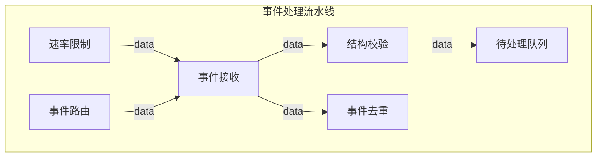

# Strategy Gallery

Archiscope ships 16 terminal-native views plus the default focused Mermaid renderer. Every view reads the same `.archmap.yaml`; only the question changes.

## Pick a view by intent

| You want to understand… | Start with |
|---|---|
| The real direction of data | `blueprint` or `flow` |
| The module currently in focus | default Mermaid renderer |
| Coupling hotspots and fan-out | `heat_matrix` |
| Core versus peripheral modules | `onion` |
| Parent/child ownership | `tree` or `mindmap` |
| Internal execution states | `statemachine` |
| Timing and critical path | `waterfall` or `hbar_gantt` |
| A fast terminal summary | `cards`, `compact_table`, or `minimal` |
| Responsibility boundaries | `grouped` or `swimlane` |
| Interfaces and callable surface | `class_diagram` |

List the canonical names at any time:

```bash
archiscope list-strategies
```

The outputs below use [`examples/medium.yaml`](../examples/medium.yaml), a fictional event-processing system.

## Focused Mermaid

Use the default renderer when you want a clean diagram for chat, Markdown, or documentation.

```bash
archiscope render demo.pipeline
```



## Blueprint

Use `blueprint` when direction matters more than decoration. It partitions control, core, and processing modules, then prints the actual edges as a readable ledger.

```console
$ archiscope render all --strategy blueprint

╔═ CONTROL ════════════╗   ╔═ CORE ═══════════════╗   ╔═ PROCESS ══════════════╗
║[01] Scheduler 调度服…║   ║ ╔══════════════════╗ ║   ║[04] Report 报表服务    ║
║[02] Gateway 接入服务 ║══▶║ ║[03] 事件处理流水…║ ║══▶║[05] Archive 归档服务   ║
║                      ║   ║ ╚══════════════════╝ ║   ║[06] Storage 数据服务   ║
╚══════════════════════╝   ╚══════════════════════╝   ╚════════════════════════╝

DATA FLOW / 实际数据流
  Scheduler 调度服务 ─────▶ Gateway 接入服务
  Gateway 接入服务   ─────▶ 事件处理流水线
  事件处理流水线     ─────▶ Report 报表服务
  事件处理流水线     ─────▶ Archive 归档服务
  Report 报表服务    ─────▶ Storage 数据服务
  Archive 归档服务   ─────▶ Storage 数据服务
```

## Coupling heat matrix

Use `heat_matrix` during design review. The matrix exposes direct coupling; the summary calls out dependency hotspots and high fan-out modules.

```console
$ archiscope render all --strategy heat_matrix

                 Gateway  Pipeline  Report  Archive  Scheduler  Storage
                 ───────  ────────  ──────  ───────  ─────────  ───────
Gateway          │·        ░         ·       ·        ·          ·
Pipeline         │·        ·         ░       ░        ·          ·
Report           │·        ·         ·       ·        ·          ░
Archive          │·        ·         ·       ·        ·          ░
Scheduler        │░        ·         ·       ·        ·          ·
Storage          │·        ·         ·       ·        ·          ·

被依赖最多 (hotspot):
  Storage 数据服务 ████ (2)
依赖最多 (fan-out):
  事件处理流水线   ████ (2)
```

## Onion view

Use `onion` to distinguish stable cores from orchestration and peripheral services.

```console
$ archiscope render all --strategy onion

            ╔════════════════════╗
            ║ 内核 (被依赖最多)  ║
            ║                    ║
            ║ Storage 数据服务 ◉◉ ║
            ║ Gateway 接入服务 ◉  ║
            ║ 事件处理流水线 ◉    ║
            ╚════════════════════╝

        ┌──────────────────────┐
        │ 外围模块             │
        │ Report 报表服务 ◉    │
        │ Archive 归档服务 ◉   │
        │ Scheduler 调度服务 ○ │
        └──────────────────────┘
```

## Strategy data requirements

Most views only need `modules`, `upstream`, and `downstream`. A few become useful when extra fields are present:

| Strategy | Recommended data |
|---|---|
| `statemachine` | `internal_flow`, including state endpoints |
| `hbar_gantt`, `waterfall` | `internal_flow[].duration_ms` |
| `grouped` | `groups` |
| `swimlane` | `lanes` |
| `class_diagram` | `functions`, `files`, upstream/downstream |

See the [schema reference](archmap-reference.md) for exact field shapes.
