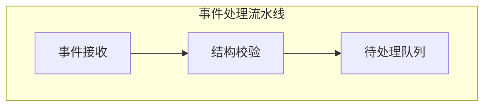

# Strategy Gallery

Archiscope 0.6.0 uses the terminal-native `overview` by default. Sixteen specialized terminal strategies remain available, and the 0.5.x Mermaid renderer is retained behind `--format mermaid`. Every view reads the same `.archmap.yaml`; only the question and presentation change.

## Pick a view by intent

| You want to understand… | Start with |
|---|---|
| Whole-system topology and ownership | default `overview` |
| One container or leaf in context | default `overview` with that path |
| The real direction of data | `blueprint` or `flow` |
| Coupling hotspots and fan-out | `heat_matrix` |
| High versus low incoming dependency count | `onion` |
| Parent/child ownership only | `tree` or `mindmap` |
| Internal execution states | `statemachine` |
| Timing and critical path | `waterfall` or `hbar_gantt` |
| A compact compatibility view | `cards`, `compact_table`, or `minimal` |
| Responsibility boundaries | `grouped` or `swimlane` |
| Interfaces and callable surface | `class_diagram` |
| Mermaid for Markdown or an existing consumer | `--format mermaid` |

List the specialized strategy names with:

```bash
archiscope list-strategies
```

The overview diagram below is a contract-level schematic with no project statistics. The specialized-view excerpts use [`examples/medium.yaml`](../examples/medium.yaml); semantic excerpts use a temporary overlay so visual families are visible without changing that example blueprint.

## Default overview

```bash
archiscope render all
archiscope render all --depth 0
archiscope render all --depth 2
archiscope render demo.pipeline
```

The default is `--format terminal --strategy overview --depth 1`. Structural type controls frame style; semantic feature controls the colored dot and badge. `▾N` means the node can be expanded and `•` means it is a leaf.

### Vertical Layered Bus Topology

```console
$ archiscope render all --charset ascii --color never

 VERTICAL LAYERED BUS TOPOLOGY - SCHEMATIC
             +..[EVT] projected feedback bus..........+
             v                                        .
L0                 +--------------------+              .
                   | [AUTH] 控制中心    |              .
                   +---------+----------+              .
              control fan-out bus                      .
             +---------------+---------------+         .
L1           v                               v         .
    +------------------+ [DAT] ----> +------------------+
    | [COMPUTE] 引擎甲 | [CMD] <---- | [COMPUTE] 引擎乙 |
    +---------+--------+              +--------+---------+
              |                               |         .
L2            v                               v         .
    +------------------+              +------------------+
    | [DATA] 存储      |              | [DELIVERY] 投递  |.
    +------------------+              +------------------+
 ISOLATED ------------------------------------------------
                   +----------------------+
                   | [ASSURANCE] 治理审计 |
                   +----------------------+
```

This is a topology schematic, not captured project output. One logical layer may contain `1..N` nodes. Available width may reflow a layer across physical rows, with each row's group centered, but logical layers, stable node order, and route classes do not change. Chinese labels remain verbatim.

Control fan-out, direct engine mesh lanes, outer feedback, and isolated nodes share the main canvas. There is no privileged longest-path chain and no detached relation ledger standing in for the graph; physical adjacency never implies an edge. Every semantic kind and direct/projected state gets an independent lane, and opposite directions merge only when both kind and projection state match. See the normative [Vertical Layered Bus Topology specification](vertical-layered-bus.md).

Strict ASCII mode (`--charset ascii --color never`) preserves the same logical topology with ASCII frames, markers, and direct/projected line styles. Every overview still ends with the current-depth ownership tree and compact legend.

## Focused containers and leaves

A focused container keeps its ownership frame and shows relations inside the selected scope:

```bash
archiscope render demo.pipeline --depth 1
```

A leaf has no ownership children, so the topology becomes upstream → focus → downstream context. The renderer does not infer missing business semantics; an unclassified module remains `[NEUTRAL]` and an unclassified relation remains `[DEP]`.

## Semantic overlay preview

First audit missing classifications:

```bash
archiscope semantics audit . --json
```

Then preview a proposal without changing `.archmap.yaml`:

```bash
archiscope render all --semantic-overlay semantic-proposal.yaml
```

The overlay may contain feature/kind candidates plus evidence, reason, and `high / medium / low` confidence. It may reference only existing modules and exact canonical relations. A confirmed-semantic conflict or topology change is rejected. The Agent shows the classification diff, legend, and preview and waits for explicit user confirmation before any targeted write-back.

## Mermaid compatibility

The default changed in 0.6.0. Add `--format mermaid` to commands whose consumer expects 0.5.x Mermaid source:

```bash
archiscope render all --format mermaid
archiscope render demo.pipeline --format mermaid
```



Mermaid never contains ANSI control sequences.

## Blueprint

Use `blueprint` when geometric direction matters more than the ownership-first default. With exactly three explicit groups it preserves their semantic titles; otherwise it uses topology-neutral inbound, hub, and outbound positions.

```console
$ archiscope render all --strategy blueprint

╔═ INBOUND ════════════╗   ╔═ HUB ════════════════╗   ╔═ OUTBOUND ═════════════╗
║[01] Scheduler 调度服…║   ║ ╔══════════════════╗ ║   ║[04] Report 报表服务    ║
║[02] Gateway 接入服务 ║══▶║ ║[03] 事件处理流水…║ ║══▶║[05] Archive 归档服务   ║
╚══════════════════════╝   ║ ╚══════════════════╝ ║   ╚════════════════════════╝
                           ╚══════════════════════╝

DATA FLOW / 实际数据流
  Scheduler 调度服务 ─────▶ Gateway 接入服务
  Gateway 接入服务   ─────▶ 事件处理流水线
  事件处理流水线     ─────▶ Report 报表服务
```

## Coupling heat matrix

Use `heat_matrix` during design review. The matrix exposes direct coupling; the summary calls out dependency hotspots and high fan-out modules.

```console
$ archiscope render all --strategy heat_matrix

                 Gateway  Pipeline  Report  Archive  Scheduler  Storage
                 ───────  ────────  ──────  ───────  ─────────  ───────
Gateway          │·        ░         ·       ·        ·          ·
Pipeline         │·        ·         ░       ░        ·          ·
Report           │·        ·         ·       ·        ·          ░
Archive          │·        ·         ·       ·        ·          ░
Scheduler        │░        ·         ·       ·        ·          ·
Storage          │·        ·         ·       ·        ·          ·
```

## Onion view

Use `onion` to compare incoming dependency counts. Its rings are a graph metric, not a claim about semantic kernels or external interfaces.

```console
$ archiscope render all --strategy onion

            ╔════════════════════╗
            ║ 高入度 (被依赖最多) ║
            ║ Storage 数据服务 ◉◉ ║
            ╚════════════════════╝

        ┌──────────────────────┐
        │ 中入度               │
        │ Report 报表服务 ◉    │
        └──────────────────────┘
```

## Specialized strategy data requirements

| Strategy | Recommended data |
|---|---|
| `blueprint` | Exactly three explicit `groups` when zone titles carry architecture semantics |
| `statemachine` | `internal_flow`, including state endpoints |
| `hbar_gantt`, `waterfall` | `internal_flow[].duration_ms` |
| `grouped` | `groups` |
| `swimlane` | `lanes` |
| `class_diagram` | `functions`, `files`, upstream/downstream |

See the [schema reference](archmap-reference.md) for the exact semantic registry and overlay shapes.
